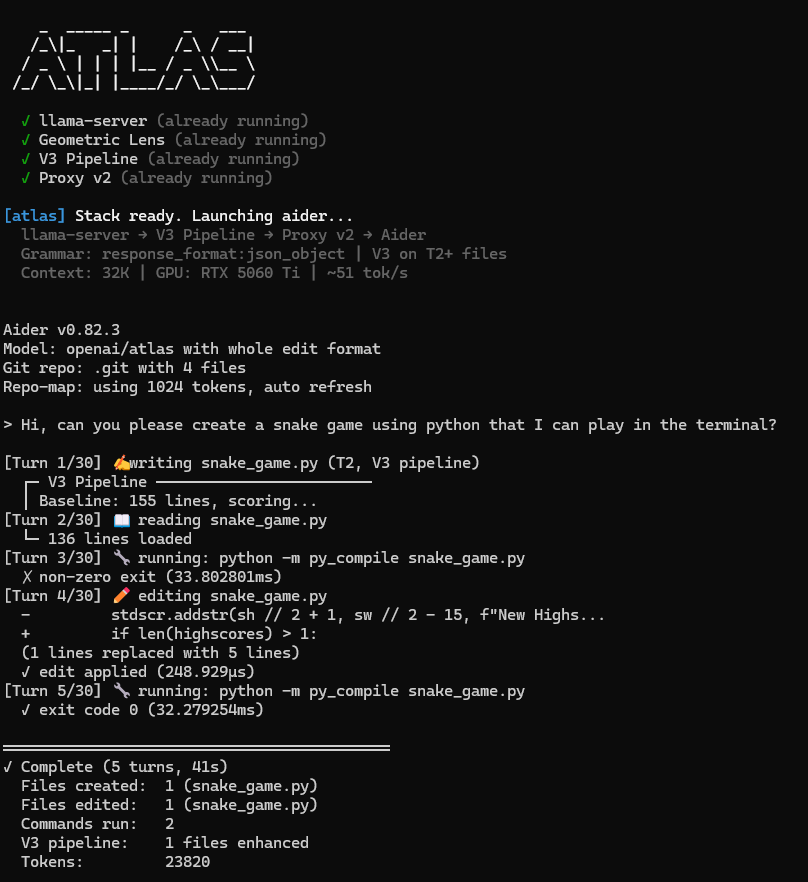

# ATLAS CLI Guide

## Launching ATLAS

```bash
cd /path/to/your/project
atlas
```

The `atlas` command starts all required services (if not already running) and launches Aider connected to the ATLAS proxy.

### Startup Banner

```
    _  _____ _      _   ___
   /_\|_   _| |    /_\ / __|
  / _ \ | | | |__ / _ \\__ \
 /_/ \_\|_| |____/_/ \_\___/

  ✓ llama-server (already running)
  ✓ Geometric Lens (already running)
  ✓ V3 Pipeline (already running)
  ✓ Proxy v2 (already running)

[atlas] Stack ready. Launching aider...
  llama-server → V3 Pipeline → Proxy v2 → Aider
  Grammar: response_format:json_object | V3 on T2+ files
  Context: 32K | GPU: RTX 5060 Ti | ~51 tok/s
```

## Streaming Output

Every operation is visible in real-time:

```
[Turn 1/30] 📋 planning subtasks...
[Turn 2/30] ✍ writing package.json (T1, direct)
  ✓ wrote successfully (1.2ms)
[Turn 3/30] ✍ writing app.py (T2, V3 pipeline)
  ┌─ V3 Pipeline ────────────────────────────
  │ Baseline: 134 lines, scoring...
  │ [probe] Generating probe candidate...
  │ [probe_scored] C(x)=0.72
  │ [plansearch] Generating 3 plans...
  │ [sandbox_test] Testing candidates...
  └──── V3 complete: phase1, 3 candidates
  ✓ wrote successfully
[Turn 4/30] 🔧 running: python -m py_compile app.py
  ✓ exit code 0 (0.3s)
[Turn 5/30] 📖 reading requirements.txt
  └─ 12 lines loaded

═══════════════════════════════════════════
✓ Complete (5 turns, 47s)
  Files created:  3 (package.json, app.py, requirements.txt)
  Commands run:   1
  V3 pipeline:    1 file enhanced
  Tokens:         8432
═══════════════════════════════════════════
```



## What ATLAS Does Well

- **Single-file creation**: Python scripts, Rust CLIs, Go servers, C programs, shell scripts — first-shot, compiles and runs
- **Multi-file project scaffolding**: Next.js, Flask, Express — correct dependency order, config files included
- **Bug fixes**: Reads existing files, identifies issues, applies targeted edits
- **Feature additions**: Reads project context, adds features using `edit_file` for surgical changes
- **Code analysis**: Reads entire codebases and explains implementation details
- **V3-enhanced quality**: Files with complex logic get diverse candidates, build verification, and energy-based selection

## What ATLAS Is Not Good At (Yet)

- **Very large existing codebases** (50+ files): The 32K context window limits how much project context the model can process at once
- **Visual output verification**: CSS styling, layout issues, and design quality cannot be verified by the sandbox
- **Real-time interactive applications**: The model cannot run a browser or test interactive UIs
- **Adding features to existing projects**: ~67% reliability (L6 test) — the 9B model sometimes over-explores instead of writing code

## Tips for Best Results

1. **Be specific**: "Create a Flask API with /users GET and POST endpoints, SQLite backend, input validation with Pydantic" works better than "Create a web app"
2. **Provide file context**: When modifying existing code, add files to the Aider chat so ATLAS can read them
3. **Complex tasks take longer**: V3 pipeline fires on feature files (50+ lines with logic), adding 2-5 minutes but producing better code
4. **Watch the terminal**: Streaming shows every tool call, V3 step, and build verification in real-time
5. **Use edit_file hints**: For large existing files, ask for specific changes rather than full rewrites

## Aider Commands

All standard Aider commands work through ATLAS:

| Command | Description |
|---------|-------------|
| `/add <file>` | Add a file to the chat context |
| `/drop <file>` | Remove a file from context |
| `/clear` | Clear chat history |
| `/tokens` | Show token usage |
| `/undo` | Undo last change |
| `/run <command>` | Run a shell command |
| `/help` | Show all commands |
