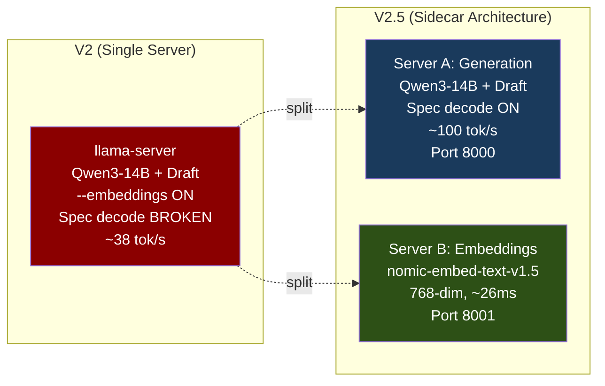
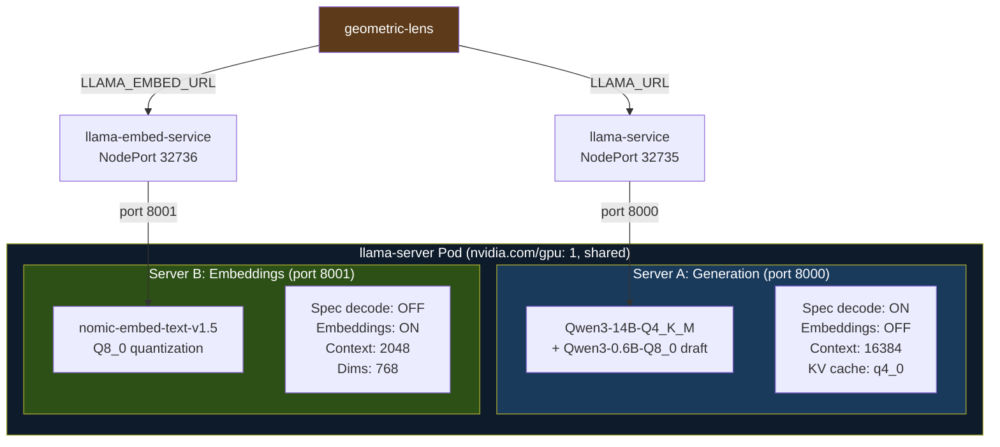

# V2 to V2.5 Migration: Two-Server Inference

> **This document describes the V2 → V2.5 architecture change. For the current architecture, see [ARCHITECTURE.md](ARCHITECTURE.md).**

Documents the infrastructure change from V2's single-server design to V2.5's two-server architecture, discovered during the V2.5 ablation study (2026-02-19 to 2026-02-21).



---

## 1. The Problem: Speculative Decoding + Embeddings Incompatibility

llama.cpp's `--embeddings` flag forces `n_batch = n_ubatch = 512` on the main model, overriding any user-specified batch size. When speculative decoding is also enabled (`--model-draft`), the draft model retains its own `n_batch` (default 8192). This mismatch causes 0% token acceptance because the draft model's batch geometry doesn't align with the main model's forced-512 batch.

**Root cause**: The embeddings pooling layer requires a fixed batch dimension that conflicts with speculative decoding's variable-length draft sequences.

**References**:
- llama.cpp PR [#17912](https://github.com/ggerganov/llama.cpp/pull/17912): Discussion of n_batch override behavior
- llama.cpp Issue [#6263](https://github.com/ggerganov/llama.cpp/issues/6263): Embeddings + speculative decoding interaction

**V2 impact**: In V2, the single llama-server ran with `--embeddings` enabled (needed for Geometric Lens scoring), which silently broke speculative decoding. Generation throughput was ~38 tok/s (no spec decode benefit), though this wasn't detected until the V2.5 ablation study.

---

## 2. The Solution: Two-Server Sidecar Architecture

Separate embedding extraction from generation by running two llama-server processes as containers in the same K3s pod.



### Server A: Generation (port 8000, NodePort 32735)

Primary inference server with speculative decoding enabled.

| Parameter | Value |
|-----------|-------|
| Model | Qwen3-14B-Q4_K_M (8.38 GiB) |
| Draft model | Qwen3-0.6B-Q8_0 (610 MiB) |
| Context | 16384 tokens (2 parallel slots) |
| KV cache | q4_0 quantization |
| Spec decode | `--draft-max 16 --draft-min 1` |
| Flags | `--cont-batching --flash-attn --mlock --no-mmap` |
| Throughput | ~100 tok/s (with spec decode acceptance ~80%) |

Managed by ConfigMap `llama-entrypoint` key `entrypoint.sh`.

### Server B: Embeddings (port 8001, NodePort 32736)

Lightweight GPU sidecar dedicated to embedding extraction.

| Parameter | Value |
|-----------|-------|
| Model | nomic-embed-text-v1.5-Q8_0 (~286 MiB VRAM) |
| Context | 2048 tokens |
| Output | 768-dimensional embeddings |
| Flags | `--embeddings -ngl 99` |
| Latency | ~26ms warm per embedding request |

Managed by ConfigMap `llama-entrypoint` key `entrypoint-embed.sh`.

---

## 3. What Changed From V2

| Aspect | V2 (Single Server) | V2.5 (Two-Server Sidecar) |
|--------|---------------------|---------------------------|
| **Servers** | 1 llama-server with `--embeddings` | 2 containers in same pod |
| **Spec decode** | Broken (0% acceptance due to n_batch mismatch) | Working (~80% acceptance, ~100 tok/s) |
| **Generation speed** | ~38 tok/s | ~100 tok/s |
| **Embedding model** | Qwen3-14B (5120-dim, self-embed) | nomic-embed-text-v1.5 (768-dim, dedicated) |
| **Embedding dims** | 5120 | 768 |
| **VRAM usage** | ~12.9 GiB (model + KV + draft) | ~12.7 GiB (model + KV + draft + embed sidecar) |
| **Flags** | `--embeddings --jinja --draft-p-min 0.9` | No `--embeddings` on main; sidecar handles it |
| **geometric-lens** | Single `LLAMA_URL` for everything | `LLAMA_URL` (gen) + `LLAMA_EMBED_URL` (embed) |

### Geometric Lens Adaptation

The Geometric Lens MLP input layer changed from 5120-dim (Qwen3-14B self-embeddings) to 768-dim (nomic-embed-text-v1.5 embeddings). This adaptation is automatic, but **V2.5.1 confirmed that candidate discrimination was lost in this switch** — C(x) went from 87.8% selection accuracy (self-embeddings) to ≈random (nomic). The Lens architecture works; it requires the model's own internal representations:

- The Lens retrains at the start of each benchmark epoch using pass/fail embeddings from the current embedding source
- `training.py` reads `input_dim` from the embedding vector length, not a hardcoded constant
- On first retrain after switching embedding sources, the MLP is rebuilt with the new input dimension

C(x) architecture at 768-dim input:
```
Linear(768 -> 512) + SiLU
Linear(512 -> 128) + SiLU
Linear(128 -> 1)   + Softplus
```

G(x) architecture at 768-dim input:
```
Linear(768 -> 512) + SiLU
Linear(512 -> 768) + Softplus
```

---

## 4. VRAM Budget

GPU: NVIDIA GeForce RTX 5060 Ti (16,311 MiB total).

Measured via `nvidia-smi` on 2026-02-21 with both servers running:

| Component | VRAM |
|-----------|------|
| Server A (Qwen3-14B + draft + KV cache) | ~12,420 MiB |
| Server B (nomic-embed-text-v1.5 Q8_0) | ~300 MiB |
| **Total** | **~12,720 MiB (78%)** |
| **Headroom** | **~3,590 MiB** |

The embed sidecar adds only ~300 MiB to the V2 baseline, while enabling speculative decoding recovers ~2.6x generation throughput. Net VRAM delta from V2: approximately -230 MiB (the sidecar is cheaper than the overhead that `--embeddings` imposed on the main model's KV cache layout).

---

## 5. Known Limitation

This two-server architecture is a workaround for a llama.cpp upstream limitation. If a future llama.cpp release decouples the embeddings pooling batch size from the main model's `n_batch` (allowing `--embeddings` and `--model-draft` to coexist without the n_batch override), the architecture can be consolidated back to a single server.

The sidecar approach has the secondary benefit of using a purpose-built embedding model (nomic-embed-text-v1.5, 137M params, trained specifically for embedding tasks) rather than repurposing the generation model's hidden states. However, this benefit came at a significant cost to the Geometric Lens — see below.

> **✅ V2.5.1 CONFIRMED — EMBEDDING SOURCE HYPOTHESIS (2026-02-23)**
>
> The V2.5 ablation found that C(x) energy scoring ≈ random for candidate selection. **V2.5.1 confirmed this was caused by the embedding source switch described in this document, NOT a failure of the Geometric Lens architecture.**
>
> With Qwen3-14B self-embeddings (5120-dim), C(x) selects the passing candidate **87.8% of the time** on mixed-result tasks vs 48.3% random — a **+39.5pp delta** (p < 0.000001). Under nomic 768-dim, this was only +0.6pp. The ARM-EBM framework requires the model's OWN representation space to function; external semantic embeddings strip the internal confidence signal that makes discrimination possible.
>
> **V3 must restore self-embeddings** while maintaining speculative decoding throughput. The two-server sidecar architecture described in this document remains valid for generation, but the Geometric Lens embedding source will change from 768-dim nomic back to 5120-dim self-embeddings. Options under investigation:
> - Separate embedding calls (batch them between generation slots)
> - Post-generation self-embedding extraction (don't use `--embeddings` flag)
> - Accept the throughput tradeoff (~45 tok/s without spec decode vs ~100 tok/s with)
> - Hybrid: nomic for routing, self-embeddings for candidate ranking only

---

## 6. Manifest and ConfigMap References

| Resource | File | Purpose |
|----------|------|---------|
| Deployment | `manifests/llama-deployment.yaml` | Pod spec with both containers |
| Embed manifest | `manifests/llama-embed-deployment.yaml` | Standalone embed deployment (deprecated by sidecar) |
| Entrypoint (gen) | `llama-server/entrypoint.sh` | Server A startup script |
| Entrypoint (embed) | `llama-server/entrypoint-embed.sh` | Server B startup script |
| ConfigMap | `llama-entrypoint` (atlas namespace) | Holds both entrypoint scripts |
| ConfigMap | `llama-templates` (atlas namespace) | Qwen3-custom.jinja chat template |
| Service (gen) | `llama-service` | NodePort 32735 -> pod port 8000 |
| Service (embed) | `llama-embed-service` | NodePort 32736 -> pod port 8001 |
| geometric-lens env | `LLAMA_EMBED_URL=http://llama-embed-service:8000` | Embedding routing |

---

## 7. V2.5 to V3.0: Self-Embeddings Restored

V3.0 resolves the embedding source tension described in Section 5 by patching llama.cpp directly.

**The fix**: A one-line patch in `tools/server/server-context.cpp` sets `params_dft.embedding = false`, preventing `--embeddings` from poisoning the draft model context. This allows a single llama-server to run spec decode + self-embeddings simultaneously.

**What changed**:

| Aspect | V2.5 (Two-Server Sidecar) | V3.0 (Single Patched Server) |
|--------|---------------------------|-------------------------------|
| **Servers** | 2 containers (gen + embed) | 1 container (patched llama-server) |
| **Embedding model** | nomic-embed-text-v1.5 (768-dim) | Qwen3-14B self-embeddings (5120-dim) |
| **Spec decode** | Working (Server A only) | Working (same server, patched) |
| **VRAM** | ~12,720 MiB (78%) | ~14,400 MiB (88%) |
| **Lens accuracy** | ~random (nomic) | 87.8% selection (self-embeddings) |
| **LCB pass@1** | 36-41% (V2) | **74.6%** (V3 pipeline) |

**Patch details**: `llama-server/Dockerfile` applies the sed patch during build. `llama-server/patches/` contains the patch file. Entrypoint: `entrypoint-v3-specdec.sh`.

**Batch sizes**: Must use `-b 4096 -ub 4096` (equal batch sizes) to avoid n_batch clamp from `--embeddings`. The `--jinja` flag is also removed (breaks spec decode via tokenization mismatch).

**VRAM constraint**: `--parallel 1` required (2 draft KV contexts = 2x896 MiB would exceed budget).
